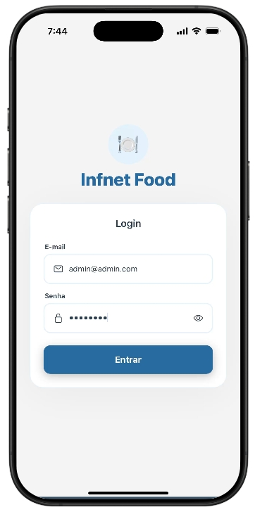
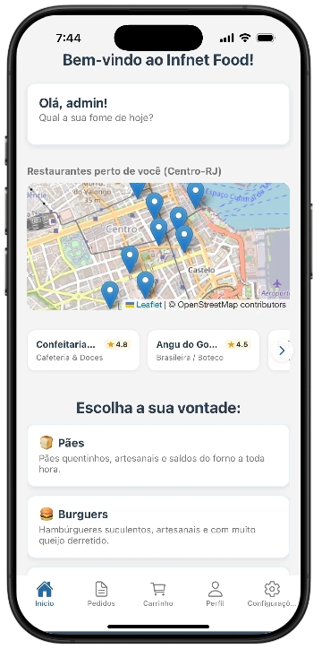
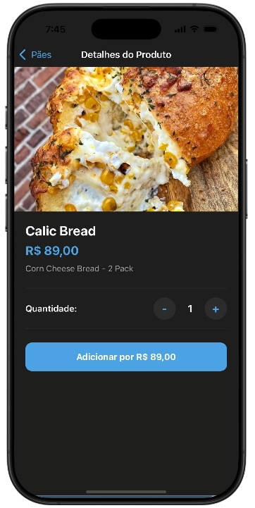

# Infnet Food 🍽️

O **Infnet Food** é um aplicativo móvel de delivery de comida desenvolvido em React Native com Expo. O app conta com navegação fluida, gerenciamento de carrinho, histórico de pedidos simulado por esteira de notificações locais e integração com APIs externas para auto-preenchimento de endereço e catálogo dinâmico de pratos.

---

## 🚀 Funcionalidades Principais

* **Navegação Temática:** Alternância dinâmica entre Modo Claro (*Light Mode*) e Modo Escuro (*Dark Mode*).
* **Autenticação:** Contexto global para simulação de login, logout e gerenciamento do perfil do usuário.
* **Catálogo Dinâmico (API Externa):** Consumo da *Free Food Menus API* para renderizar os pratos em tempo real com base na categoria selecionada.
* **Carrinho de Compras:** Adição, remoção e cálculo automatizado de valores dos itens selecionados.
* **Checkout Inteligente (API Externa):** Integração com a API do *ViaCEP* para preenchimento automatizado de logradouro, bairro e cidade a partir do CEP digitado.
* **Esteira de Notificações Locais:** Agendamento de notificações push simulando o status real do pedido ("Confirmado", "Na Cozinha" e "A Caminho").

---

## 🛠️ Tecnologias Utilizadas

* **React Native / Expo** (SDK mais recente)
* **React Navigation** (Stack & Tabs)
* **Context API** (Gerenciamento de Estado Global para Tema, Autenticação e Carrinho)
* **Expo Notifications** (Disparo de notificações locais push)
* **Fetch API** (Integração HTTP com ViaCEP e Menus API)

---

## 📸 Demonstração da Aplicação (Prints)

Abaixo estão as capturas de tela do aplicativo rodando em ambiente de testes:

| Tela de Login | Tela Inicial / Home | Detalhes do Produto (Dark Mode) |
| :---: | :---: | :---: |
|  |  |  |

---

## 📦 Como Executar o Projeto

Siga os passos abaixo para rodar a aplicação localmente no seu computador ou dispositivo móvel:

### Prerequisites (Pré-requisitos)
* Ter o **Node.js** instalado na sua máquina.
* Ter o aplicativo **Expo Go** instalado no seu celular (Android ou iOS) para testar fisicamente, ou um emulador configurado.

### 1. Clonar o Repositório
```bash
git clone [https://github.com/MayFran0212/Infnet-Food.git](https://github.com/MayFran0212/Infnet-Food.git)
cd NOME_DO_SEU_REPOSITORIO
